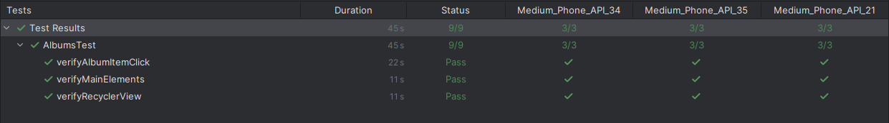
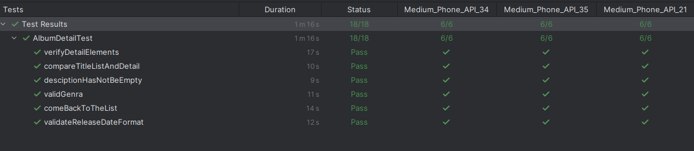
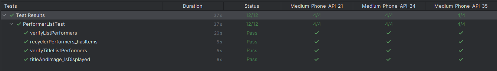
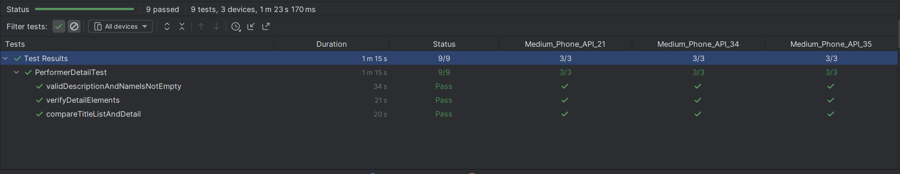
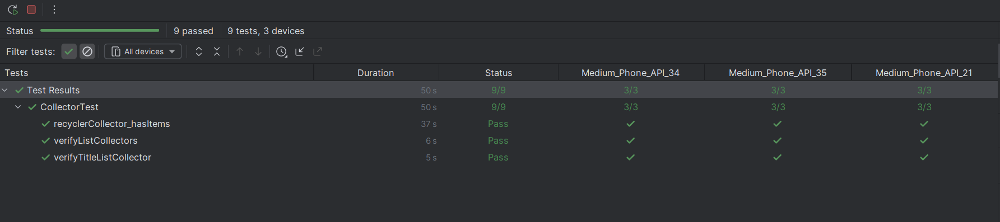

# Resultados de pruebas | Primera entrega

En la estrategia de pruebas de la primera semana se consideran principalmente los siguientes escenarios:

# Funcionalidades

| Función                              | Descripción                         |
|--------------------------------------|-------------------------------------|
| Consultar catálogo de álbumes        | Ver lista de álbumes disponibles    |
| Consultar información de un álbum    | Ver detalles de un álbum específico |
| Consultar catálogo de artistas       | Ver lista de artistas disponibles   |
| Consultar información de un artista  | Ver detalle de un artista           |
| Consultar catálogo de collecionistas | Ver lista de coleccionistas         |

Mayor detalle en el link de la [estrategia de pruebas](https://docs.google.com/document/d/1wCbXwYll5YlUlBj6UDtJOGkUsACY57r5/edit)

Resultados Pruebas realizadas en la funcionalidad #1 Consultar catálogo de álbumes

## Listado de Álbumes
### Casos probados:
**verifyMainElements:**
Este caso permite validar que los principales elementos de la interfaz aparezcan en pantalla. Elementos como menú, títul de la aplicación, caja de busqueda, título de listado de álbumes, botón de búsqueda.

**Resultado:**
Como se observa en la captura, se confirma su correcto funcionamiento.

**verifyRecyclerView:**
Este caso permite validar que el Recicler View cuenta con los elementos dentro y aparece dentro de la pantalla.

**Resultado:**
Como se observa en la captura, se confirma su correcto funcionamiento.

**verifyAlbumItemClick:**
Este caso de prueba permite validar que al hacer click a un elemento del listado de álbumes se abre correctamente el detalle de cada álbum.

**Resultado:**
Como se observa en la captura, se confirma su correcto funcionamiento.

## Detalle de Álbum
### Casos probados:
**verifyMainElements:**
Este caso permite validar que los principales elementos de la interfaz aparezcan en pantalla. Elementos como el título del álbum, descripción, cover, fecha de lanzamiento del álbum, dtracks relacionados.

**Resultado:**
Como se observa en la captura, se confirma su correcto funcionamiento.

**comeBackToTheList:**
Este caso permite validar que se puede regresar desde la imagen de detalle al listado por medio del botón ubicado en la parte superior izquierda.

**Resultado:**
Como se observa en la captura, se confirma su correcto funcionamiento.

**compareTitleListAndDetail:**
Este caso permite comparar el título al que se le hace click versus el que aparece en el detalle de álbum.

**Resultado:**
Como se observa en la captura, se confirma su correcto funcionamiento.

**desciptionHasNotBeEmpty:**
Este caso permite validar que la descripción de álbum aparezca y no esté vacia.

**Resultado:**
Como se observa en la captura, se confirma su correcto funcionamiento.

**validateReleaseDateFormat:**
Este caso permite validar que la fecha de lanzamiento de álbum aparezca visible dentro de la pantalla.

**Resultado:**
Como se observa en la captura, se confirma su correcto funcionamiento.

**validGenra:**
Este caso permite validar que el genero que muestra esté dentro del formato requerido en los enumerables.

**Resultado:**
Como se observa en la captura, se confirma su correcto funcionamiento.

## Listado de Artistas
### Casos probados:
**verifyTitleListPerformers:**
Este caso permite validar que los principales elementos de la interfaz aparezcan en pantalla. Elementos como nombre del artista y el título de la sección.

**Resultado:**
Como se observa en la captura, se confirma su correcto funcionamiento.

**verifyListPerformers:**
Este caso permite validar que la lista de performers (Artistas) sea visible en la pantalla.

**Resultado:**
Como se observa en la captura, se confirma su correcto funcionamiento.

**recyclerPerformers_hasItems:**
Este caso permite validar el Recicler Performer contenga elementos dentro y los esté mostrando de forma correcta.

**Resultado:**
Como se observa en la captura, se confirma su correcto funcionamiento.

**titleAndImage_IsDisplayed:**
Este caso permite validar que la imagen de cada artista se este mostrando en pantalla de forma correcta.

**Resultado:**
Como se observa en la captura, se confirma su correcto funcionamiento.

## Detalle de Artista
### Casos probados:
**verifyDetailElements:**
Este caso permite validar que los principales elementos de la interfaz aparezcan en pantalla. Elementos como el título del artista, descripción, etc.

**Resultado:**
Como se observa en la captura, se confirma su correcto funcionamiento.

**compareTitleListAndDetail:**
Este caso permite comparar el nombre del artista al que se le hace click versus el que aparece en el detalle del artista.

**Resultado:**
Como se observa en la captura, se confirma su correcto funcionamiento.

**validDescriptionAndNameIsNotEmpty:**
Este caso permite validar que el nombre y la descripción del artista aparezca y no esté vacia.

**Resultado:**
Como se observa en la captura, se confirma su correcto funcionamiento.

## Listado de coleccionistas
### Casos probados:

**verifyTitleListCollector:**
Este caso permite validar que los principales elementos de la interfaz aparezcan en pantalla. Elementos como el título de la sección.

**Resultado:**
Como se observa en la captura, se confirma su correcto funcionamiento.

**verifyListCollectors:**
Este caso permite validar que la lista de coleccionistas sea visible en la pantalla.

**Resultado:**
Como se observa en la captura, se confirma su correcto funcionamiento.

**recyclerCollector_hasItems:**
Este caso permite validar el Recicler Collector contenga elementos dentro y los esté mostrando de forma correcta.

**Resultado:**
Como se observa en la captura, se confirma su correcto funcionamiento.

 

